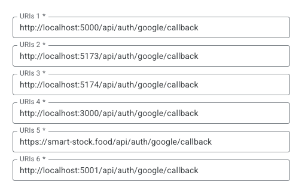

# How to Set Up Google Auth locally

## Set up Google Project

1. Go to google cloud console. 
2. Go to APIs & Services/OAuth consent screen (Hamburger menu)
    1. Fill out the necessary information
4. Go to APIs & Services/Credentials/OAuth 2.0 Client IDs
    1. Create credentials and fill out the necessary information
    2. Under Authorized redirect URIs put all possible URIs just in case. I have:
    
    3. Copy the Client ID and Client Secret and add it to the .env file for the server (.env.sample contains the names for those)
    4. Save the information and test. 